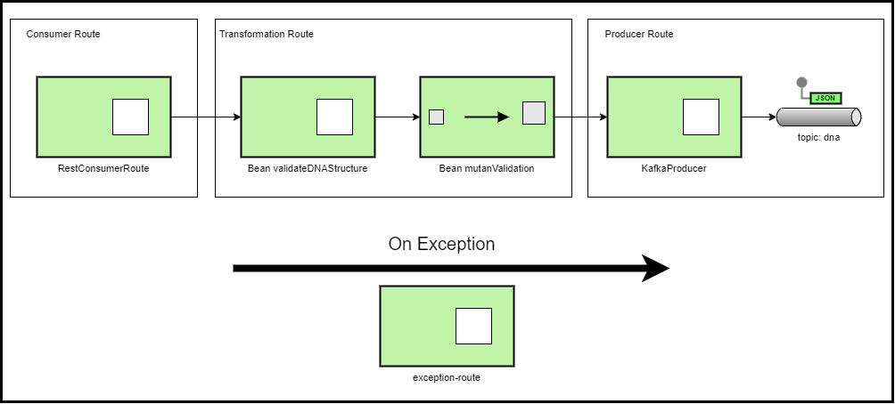

# mutant-detector
[](https://app.travis-ci.com/leosthewar/mutant-detector)
[](https://coveralls.io/github/leosthewar/mutant-detector?branch=main)

Challenge técnico Mercado libre

Servicio REST Post para detectar si una secuencia de ADN corresponde a un mutante y enviar el resultado de la validación a una topic de Kafka.

# Herramientas, tecnologías y lenguajes

- Sistema operativo: Windows 10
- Java 11
- Spring Boot 2.4.13
- Camel 3.7.0
- Undertow
- Eclipse IDE
- Visual Studio
- Jacoco
- Coveralls
- Travis CI
- JKube
- MongoDB
- Openshift
- Apache kafka


### Arquitectura de software y patrones destacados
- Microservicios
- Patrón de Integración empresarial - EIP
- Patrón de cadena de responsabilidad
- Arquitectura orientada a eventos 


# Diagram EIP


# Descripción técnica

El servicio expone un WS tipo Rest con el método POST -> /mutant/ para recibir una secuencia de ADN.

En la ruta de transformación, el servicio inicialmente realiza la validación de la estructura de la secuencia de ADN.

Si la estructura es invalida, el servicio responde con HTTP ->403 y mensaje con el error.

Si la estructura es correcta el servicio realiza la validación del ADN para detectar si es un mutante.

Toda la lógica de la validación se encuentra en el paquete com.meli.challenge.mutant.detector.validator.
En la clase MutantValidator se ha creado el metod boolean  isMutant, El cual recibe como parámetro una lista Strings con la secuencia de ADN a validar.  El método realiza la validación de la secuencia por filas, columnas, diagonales ( en ese orden,  utilizando el patron chain of responsability).  

Una vez realizada la validación, produce un evento enviando un mensaje en el topic -> dna creado en Apache Kafka. En el mensaje se envía  secuencia de ADN y el resultado ( si es mutante o no ).
Finalmente si el ADN corresponde a un mutante, el servicio responde HTTP-> 200, en caso contrario HTTP -> 403
 

# Servicio mutant

## POST /mutant/

Request

- Content-Type: application/json

Payload ejemplo
```shell
{
  "dna":["ATCCG","CAGCG","TTCTG","ACAAT","CCCAT"]
}
```


Response
- HTTP Code 200 - Si el ADN es mutante
- HTTP Code 403 - Si el ADN es NO mutante

# Instrucciones de ejecución

## Ejecución local

### Prerrequisitos

- [JDK 11](https://openjdk.org/projects/jdk/11/)
- [Maven 3](https://maven.apache.org)

Para ejecutar el servicio de manera local ejecute el comando 
```shell
mvn spring-boot:run
```
El servicio iniciaria en el puerto 8080.
Para su ejecucion local puede usar el siguiente CURL
```shell
curl --location --request POST 'http://localhost:8080/mutant/' \
--header 'Content-Type: application/json' \
--data-raw '{
  "dna":["ATCCG","CAGCG","TTCTG","ACAAT","CCCAT"]
}'
```

## Despliegue en Openshift
### Prerrequisitos
- Cluster de Openshift
- Credenciales de acceso al cluster
- CLI  Openshift
Para este caso se uso un servidor sandbox proporcionado por Redhat https://developers.redhat.com/developer-sandbox


Para desplegar el servicio en Openshift,  se usa la CLI de Openshift ejecutando los siguientes comandos 
- Iniciar sesión  
```shell
oc login
```
- Seleccionar el Project ( en este caso en el sandbox crea un project de manera automática y no se permite crear mas , por lo cual este paso se puede omitir) 
```shell
oc project <project>
```
- Crear Configmap con los propiedades del servicio
```shell
oc create configmap mutant-detector-config --from-file=src/main/resources/  --dry-run=client -o yaml | oc apply --force -f -
```
- Compilar y desplegar 
```shell
mvn -Popenshift clean package  oc:build oc:resource oc:apply -DskipTests
```
Se crearan, entre otros los  siguientes recursos de Openshift:

 - ImageStream "mutant-detector"
 - BuildConfig "mutant-detector"
 - DeploymentConfig "mutant-detector"
 - Service "mutant-detector"
 - Route  "mutant-detector"


Para consultar la ruta  mediante la cual se puede consumir el servicio,   ejecute el comando 
```shell
oc get route mutant-detector
```
 La ruta para el presente proyecto es 

https://mutant-detector-leosthewar-dev.apps.sandbox-m2.ll9k.p1.openshiftapps.com


CURL de ejemplo para consumir el servicio: 

 ```shell

curl --location --request POST 'https://mutant-detector-leosthewar-dev.apps.sandbox-m2.ll9k.p1.openshiftapps.com/mutant/' \
--header 'Content-Type: application/json' \
--data-raw '{
  "dna":["ATGCG","CAGCG","TTCTG","ACAAT","ACCAT"]
}'
```

### Consideraciones 
Para las ejecuciones locales y en openshift se deben tener configuradas las properties de  conexión y credenciales del servidor de apache kafka