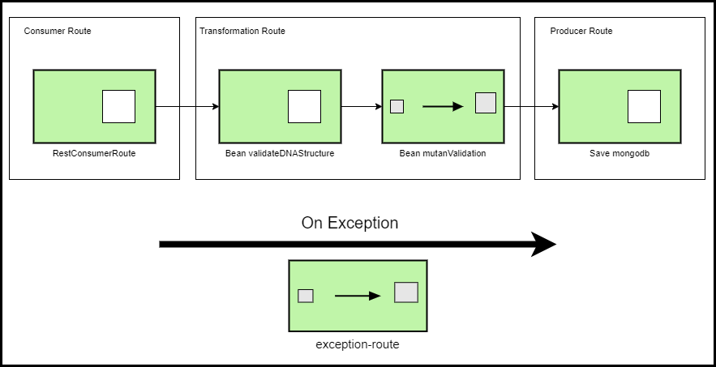

# mutant-detector

[](https://app.travis-ci.com/leosthewar/mutant-detector)
[](https://coveralls.io/github/leosthewar/mutant-detector?branch=main)

Challenge técnico Mercado libre

Servicio para detectar si una secuencia de ADN corresponde a un mutante

# Herramientas, tecnologías y lenguajes

- Sistema operativo: Windows 10
- Java 11
- Spring Boot 2.4.13
- Camel 3.7.0
- Eclipse IDE
- Visual Studio
- Jacoco
- Coveralls
- Travis CI
- MongoDB
- Openshift
- 

# Arquitectura de software
- Microservicios
- Patron de Integracion empresarial - EIP


# Diagram EIP



# Descripción tecnica

El servicio expone un WS tipo Rest con el metodo POST -> /mutant/  para recibir una secuencia de ADN.

En la ruta de transformacion, el servicio inicialmente realiza la validacion de la estructura de la secuencia de ADN. 

Si la estructura  es invalida, el servicio responde con HTTP ->403  y mensaje con el error. 

Si la estructura es correcta el servicio realiza la validacion del ADN para detectar si es un mutante. Toda la logica de la validacion se encuentra en el paquete com.meli.challenge.mutant.detector.validator.


Una vez realizada la validacion, el servicio almacenara la secuencia de ADN y el resultado ( si es mutante o no ) en la base de datos ->mutant, collection->dna utilizando el motor de base de datos No SQL Mongo.
Finalmente  si el ADN corresponde a un mutante, el servicio responde HTTP-> 200, en caso contrario HTTP -> 403 

Para compilar y ejecutar la apliación se necesita 

# Servicio mutant

## POST /mutant/

Request

- Content-Type: application/json
```shell
{
  "dna":["ATCCG","CAGCG","TTCTG","ACAAT","CCCAT"]
}
```


Response
- Code 200 - Si el ADN es mutante
- Code 403 - Si el ADN es NO mutante

# Instrucciones de ejecución
## Prerequisitos

- [JDK 11](https://openjdk.org/projects/jdk/11/)
- [Maven 3](https://maven.apache.org)

## Ejecución local

Para ejecutar el servicio de manera local ejecute el comando 
```shell
mvn spring-boot:run
```
El servicio iniciaria en el puerto 8080.
Para su ejecucion local puede usar el siguiente curl
```shell
curl --location --request POST 'http://localhost:8080/mutant/' \
--header 'Content-Type: application/json' \
--data-raw '{
  "dna":["ATCCG","CAGCG","TTCTG","ACAAT","CCCAT"]
}'
```

## Despliegue en Openshift

Para desplegar el servicio en OpenShift,  usar la CLI de OpenShift y ejecutar el siguiente comando:
```shell
oc new-app --as-deployment-config --name=mutant-detector  registry.redhat.io/fuse7/fuse-java-openshift-jdk11-rhel8~https://github.com/leosthewar/mutant-detector 
```

El cual creara los siguientes recursos de Openshift:

 - ImageStream llamado "mutant-detector"
 - BuildConfig llamado "mutant-detector"
 - DeploymentConfig llamado "mutant-detector"
 - Service llamado "mutant-detector"

Posteriormente y para acceder al servicio desde afuera del cluster de Openshift, se debe crear una ruta para exponer el service "mutant-detector", para lo cual ejecute el siguiente comando

```shell
oc create route edge --service=mutant-detector
```

